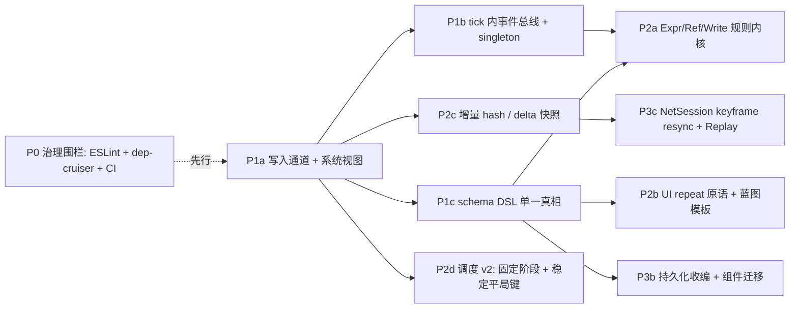

# ZeroCraft 引擎架构评审 · 2026-09-02 —— 分层理论·缺陷·扩展性·局限·改进方案

> owner 令：「对基础代码库做 review，不看游戏；我这种分层的理论、引擎有什么缺陷、扩展性、局限性、怎么改进，给一个解决方案的 review。」
> 范围 = 引擎面 `src/{engine,skills,assembly,runtime,renderer,ui,services,net,debug,bench}` + `scripts/` + 构建/包边界。**不含 `games/`**（只把游戏层的代码量当作引擎分层是否兜住的量尺）。
> 方法 = Lead 亲读内核（world / topological-sort / engine / manifest / determinism / condition / flow）+ 5 路子系统评审员并行逐文件真读（内核与协议 · capability 层 · 渲染与 UI · net 与 services · 治理与构建）+ Lead 对每份报告的关键断言独立复跑（grep/读码/一次 vite build）。**本文只写评审与方案，不动代码；所有「补引擎缺口」提案按缺口裁决协议留 owner 判 A/B。**
> 与既有评审的关系：`engine-review-2026-08-04.md`（110+ 条点状发现，已修 13）与 `engine-deep-review-2026-08.md`（地基实证体检）是「找 bug」；`base-capability-review-2026-07-03.md` 是「词汇表缺什么」。**本文是「结构」**：分层理论对不对、内核的形状封顶了什么、下一阶段先动哪块。点状问题不重复上报。

---

## 0. 一句话结论

**分层理论是对的，且在代码里是真的被执行的**：依赖方向干净、sim 核零 DOM/零墙钟、组件全 POD 可快照、确定性纪律渗透到每个文件头。**但内核有一个形状级缺陷——`World` 看不见写入**（系统拿到整个世界、原地改对象字段）。今天引擎最贵的六个结构性问题（全量 hash、软环平局裁决、事件模型 hack、reads/writes 申报不可验、DSL 直写 Resource 成环、无 delta/回滚）**全部是它的下游**。改进方案因此不是「十几处各修各的」，而是一条主线：**先给 World 装上写入通道与系统视图，再在其上收拢事件、表达式、schema 三个内核**；平台层（包边界、CI、持久化、联机）跟在后面。

---

## 1. 分层理论 vs 代码现实

### 1.1 理论（宪法 §3）

| 层 | 形态 | 谁碰 |
|---|---|---|
| 组合 Composition（实体+组件+能力接线） | 数据 | AI / 用户 |
| 导演 Director（流程/状态序列） | 数据 | AI / 用户 |
| 自定义规则 Custom-Rule | 数据（声明式 DSL） | AI / 用户 |
| 能力 Capability（词汇表） | 代码 | 只有引擎团队 |

### 1.2 依赖方向实测（引擎面模块间 import 计数，测试文件除外）

```
skills → engine 582 · renderer → engine 116 · assembly → engine 27 · net → engine 22 · services → engine 12 · ui → engine 7
反向/横向：engine → ui 1（仅类型）· net → skills 1（arena.ts demo）· assembly → runtime/renderer 2（demo.run.ts）· services → renderer 2（宿主合成根）
```

**判定：方向纪律成立**。唯一语义上的倒挂是 `engine/protocol/components/render.ts:5` 让**协议依赖 UI 的 `LayoutNode` 类型**（WorldUI3D 富内容），使 engine/protocol → ui → renderer 在类型层成环。小，但它说明「协议」和「表现」的边线在 3D 线上被踩过一次。

### 1.3 三个「数据层」在代码里的落点

| 理论层 | 代码落点 | 成色 |
|---|---|---|
| 组合 | `manifest.ts` → `WorldBlueprint` → `Engine.load`；schema 校验 + 引用链接器 + assetKey 硬校验 | ✅ 真的是数据；但校验只盖标量（§2 D5） |
| 导演 | `t3-flow`（状态机）+ `t3-timeline`（cue 队列）+ `t3-dialogue` | ✅ 是数据；但三者各自实现一套动作动词（§2 D4） |
| 自定义规则 | `ConditionExpr` / `Effect` / `SelfRule` / `BehaviorTree` / `DuelMatrix` / `ModifierStack` / `StatBind` / `TextBinding`… | ⚠ **≥12 套小语言**，无共同表达式内核（§2 D4） |
| 能力 | atoms 31 + tier1 8 + tier2 50 + tier3 13 ≈ 102 | ✅ 代码只在这里；但 tier2 成了大口袋，且 genre 专属件与通用件同层（§2 D10） |

### 1.4 理论没画出来、但真实存在的第五层：**宿主胶水**

理论说「游戏 = 数据」。量尺：出口/新项目游戏目录里的 TS 行数（不评游戏本身，只看引擎让它们**不得不写**什么）：

| 游戏 | TS 行 | JSON 文件 | TS 花在哪（按文件） |
|---|---|---|---|
| game108 | 5106 | 0 | `duel-screen.ts` 1858（UI builder）· `blueprint.ts` 994（蓝图当 TS 写）· `game108.ts` 651（宿主 mount）· 主题/美术/音频接线 ~1300 |
| game-a | 3208 | 0 | `hud.ts` 979（UI builder）· `guandan-session.ts` 571 · `game-a.ts` 438（宿主）· `ai.ts` 261 · `rules.ts` 161 |
| game-d | 1597 | 0 | 宿主 + 战斗 + 骰子 |
| game101 | 1404 | 9 | 唯一有 JSON layout 的（`s1.layout.json`，静态屏） |

四类代码是**引擎逼出来的**，不是游戏偷懒：
1. **蓝图是 TS 而不是 JSON**——JSON 表达不了循环/模板/派生（无 prefab 参数化、无 `repeat`），于是 `buildBlueprint()` 成了常态。
2. **UI 是 TS builder**——LayoutNode 只有 `bind`（3 个控件）+ `visibleWhen`，**没有集合迭代原语**，任何手牌/背包/榜单都要 TS 每帧整树重建（games 内 32 处 `ui.update(build…())`）。
3. **宿主 mount 每家手拼**——`manifest-game.ts` 是「最小宿主」（无键盘/手柄、无 FrameService）而非「标准宿主」；`Engine` + renderer + input + run-loop + overlay 的接线各写一遍。
4. **美术/音频/主题接线**——art-slots/theme/audio/voice 的胶水没有数据化入口。

**这一层才是「游戏 = 数据」承诺今天的真实缺口**，而不是词汇表少几个能力。宪法 §8「UI 与新玩法是最硬的两座堡垒」判断准确；本文把它精确到：**堡垒 = 无 UI 迭代原语 + 无蓝图模板化 + 无标准宿主**。

### 1.5 记分卡

| 维度 | 评分 | 一句话 |
|---|---|---|
| 分层方向纪律 | A | 实测干净，唯一倒挂是类型级 |
| sim 核纯度（无 DOM/墙钟/裸随机） | A- | 靠约定不靠围栏：`RendererBackend.init(HTMLElement)` 在 core 类型里；无 ESLint |
| 数据层可表达性 | C+ | 组合/导演是数据；规则层 12 套 DSL；UI/蓝图/宿主仍是 TS |
| 内核形状（存储/调度/事件） | C | 写入不可见是根；事件靠组件模拟；调度平局键 = manifest 顺序 |
| 确定性承诺的兑现 | B- | 单机/同浏览器可靠；跨平台（浮点全精度进 hash、hypot/cos）与 3D 物理不在承诺内 |
| 可扩展（加能力/加后端/加控件） | C+ | 7 处手工触点；数据卡带全量打包 102 能力；3D 后端 = 重写 20 种组件解释 |
| 治理强制力 | D+ | 179 个脚本、0 个 AST/类型级守卫、无 CI 跑门禁、基线荣誉制 |

---

## 2. 核心缺陷（按「封顶未来的程度」排序）

每条：证据 → 为什么是结构问题 → 它封死了什么。改法在 §5。

### D1 · World 看不见写入（根因）

- `world.ts:148` `system.execute(this)` 递整个世界；系统 `getComponent` 拿到可变对象后原地改（`rotation-apply.ts:30` `t.rotation += v.angular`）。World 唯一的变更信号是全局 `version`（`world.ts:9`），只被 `spatial-query` 当缓存键。
- 于是：`snapshot()` 只能全量 `structuredClone`（`:178`）；`Engine.hash()` 每次把全世界 canonical 成一个大字符串（`determinism.ts:48-63`）；lockstep **每 peer 每拍**全量快照 + 全量字符串化（`lockstep-tab.ts:130,317`）；`state-sync` 的 delta 是「两份全量快照做 diff」；渲染器每帧全表重走。
- **封死**：增量 hash、脏渲染、delta 快照、廉价回滚、以及 D2 的申报校验——它们都需要「谁写了什么」这个信息。

### D2 · 调度序是游戏数据，且申报不可验

- `reads/writes/consumes` 的**唯一消费者是排序器**（`topological-sort.ts:38`），不拦截、不校验。申报错 = 静默换序（CLAUDE.md 记录的 ENG-02「接缝静默失效」就是这个形状；`hitbox.ts:129` 的 reads 是审计后补的）。
- 软环平局键 = 系统在输入数组的下标（`topological-sort.ts:119-121`）= `Engine.load` 遍历 `blueprint.capabilities` 的顺序（`engine.ts:36-40`）= **manifest `capabilities: string[]` 的顺序**；未声明时 = `inferCapabilityIds` 遍历 JSON 键的顺序（`capability-registry.ts:256-264`）。文件头自述 65 对软环。**两端 capabilities 列序不同 → 环内系统换序 → 状态分叉**，且 warn 只进 stderr。
- 相位表 `0/4/10/14/20`（`types.ts:316-322`）：`Rotate` 存在的唯一理由是 rotation-apply 与 motion-apply 都 RMW Transform——**这是缺「字段级写粒度」的补丁，不是管线阶段**。
- **封死**：「能力自由拼装」的产品承诺建立在偶然正确之上；联机稳健性同受其累。

### D3 · 事件模型欠功率

- 事件 = 组件。一实体一份（Map 按 type 键）；`consumes` 是「首个消费者独占」（`world.ts:150-158`，只剩 9 个能力用）；主流退化为生产者自清，而 **`event-when.ts:69` 清掉全世界所有 Signal，包括别人发的**；clickable/keybind 各自再清一遍。
- 外溢出的 hack（全是实证）：timeline 每 cue 造载体实体 `tl:${id}#${seq}`；matrix-duel「一效果一个瞬时载体实体」+ 被迫拆成两个 system「播报必须排 event-when 之后否则当拍被抹」；`hitbox` 同拍多命中写覆盖；`self-rule` 同拍多 spawn 互相覆盖；`EventWhen.source`/`KeyBinding.source` 「代发」字段只为绕过主体挂不下第二份组件；`queueResourceMod` 的「合并/覆盖退化」边界。
- **封死**：多读者事件、每实体多事件、与定序解耦——事件越多，定序越脆，按能力数平方增长。

### D4 · 规则层 DSL 碎片化，直写 Resource 是 65 对环的根因

- 至少 12 套小语言：`ConditionExpr`、`evaluateSelfCondition`（重复实现 `cmp`）、`Effect` 10 kind、`SelfAction`、`FlowAction`、`TimelineCueDo`（字段名 `flagId/amount` 与 Effect 的 `targetId/value` 不同）、`DialogueEffect`、`ModifierSource`（第三种 `valueFrom` 形状）、`StatBind`（可写任意组件任意字段）、`TextBinding/Gauge`、`PerCardWhen`（第二棵独立 and/or/not 树）、`ResourceModify.scope`（第五种寻址）。
- 「钳进 [min,max] 改资源」实现了 **5 份**：`effect-apply.ts`、`self-rule.ts:77`、`flow.ts:41`、`timeline.ts:39`、`resource-apply`。前四份**直接写 Resource、绕过 ResourceModify 事件**——每个新 DSL 都成为 Resource 的又一个 writer，这正是 `topological-sort.ts:16` 记录的 RMW 成环的来源。
- **封死**：「最弱 LLM 一致产出」——12 套寻址/字段名各异的语法，弱模型必然混用；也封死统一校验与统一迁移。

### D5 · 组件 schema 五份手维护真相，嵌套数据零校验

- 手维护：① `protocol/components/*.ts` 接口；② 各能力 `provides[].fields`（102 处）；③ `component-map.ts`（283 行手抄）；④ `NON_DETERMINISTIC`（`determinism.ts:35`）；⑤ `validate-references.ts:306-313` 手编引用语义。派生两份（universe.gen、catalog）。
- `FieldType`（`define-capability.ts:5`）无对象/嵌套/枚举。`event-when.ts:38` 把 ConditionExpr 声明为 `type:'string'`——**schema 在说谎**；`validate-manifest.ts` 自认只查 number/boolean。于是**真正承载玩法的嵌套数据（条件树/效果/流程/对话/prefab）零结构校验**，而这正是 LLM 直接生成的那层。
- manifest 无版本字段；`CapabilityDefinition.version` 零消费者；字段改名 → 旧档 hash 仍过、restore 后读到 `undefined` → NaN 漂移。
- **封死**：版本迁移、可信校验、由 schema 派生文档/目录/hash 名单。

### D6 · 输入三套真相，输入层藏着一个 system

- 原子 `i1-input-capture` 的 `RawInput` **全库零读零写**（死契约）；`i2-action-map` 的 `Action` 只由 `commands.ts:86` 硬编码写、`jump.ts` 一个读者；真实契约是 `InputQueue`。线上格式 `NetMsg.input` 只有 `dx/dy/jump`——`Command.actions`（指针/UI/牌码）**不上网**。
- `applyMovement`（`commands.ts:70-88`）每拍清零所有 `Controllable` 速度并直写 `Velocity`——**一个不在调度图里的 system**。
- **封死**：卡牌/合成类项目（A/B/C/101）今天根本无法走 lockstep；录放（Recorder 录的是注入组件不是 Command）与 Engine 输入路径不相交。

### D7 · 渲染提取层只盖 2D；3D 线让渲染器写世界

- `collectRenderables` 只抽 6 种 2D 组件；ThreeRenderer 绕过提取层直接 `query` 20 种 3D 组件（55 处 `getComponent`）——**两套渲染协议**。
- `physics.ts:75-77` 渲染器改写 `Transform3D`；cannon 在渲染器里跑；结果只以信号回流。`FixedStepClock.alpha` 存在但**零渲染器插值**（`engine.ts:74` 不传）。`RendererBackend.init(container: HTMLElement)` 把 DOM 类型拖进 core。
- **封死**：3D 后端可替换性（= 重写 20 种解释）；非 DOM 宿主；3D 物理类游戏事实上退出 lockstep/replay（两端各跑本地物理各发信号，无权威）。

### D8 · UI 无迭代原语；`{custom}` 样式逃生口未消毒

- 数据绑定全部表达力 = `bind`（Label/ProgressBar/Image）+ `visibleWhen`。无 repeat/list/模板 → 见 §1.4。diff 用 `JSON.stringify(props)` 判等、变了整子树 `outerHTML` 重渲（`server.ts:68-127`）。
- 令牌闭集是真的，但 `resolveFill`（`render.ts:277-285`）对 `{custom}` 与遗留裸串**原样拼进 `style="…"`**，未过 `safeColor`/`esc`；`onboarding-overlay.ts:57` 手拼 HTML 游离于 LayoutNode 外。`ui/shell` + 第二套主题系统仍活（只剩冻结的 game-f），`GameOverlay.tsx`/`templates/Bar.tsx` 零 import。
- **封死**：纯数据 UI 只能是静态屏；数据边界在样式口最薄。

### D9 · 快照 = 全量 structuredClone，给联机/回滚/录放统一定价

- 回滚网络码 = 每拍一份全量 clone + 全量 restore + 重跑；Tracer 每 system 前后各 snapshot；Recorder 每拍全量快照（1 分钟 60Hz 中型世界 ≈ 数十 MB）。
- 现有 net 是**双标签页 demo**：传输只有 `BroadcastChannel`，零 WebSocket/WebRTC，desync 只置旗不 resync，成员变化 = 回 tick 0 重开，无服务端、无观战。
- **封死**：回滚/预测（在此存储上不可行）；唯一可走的路是「权威/keyframe resync」（§5 P3）。

### D10 · 单体静态注册表 + tier 大口袋 + 全量打包

- 加一个能力碰 7 处（文件、tier index、registry、protocol、重生成 universe/map、NON_DETERMINISTIC、测试），其中 3 处纯机械。`CAPABILITY_REGISTRY` 模块初始化即全量 `new Map` → Rollup 零摇树：**实测 `__inline__` 数据卡带壳 340 KB min，`ALL_CAPABILITIES` 无条件全入包**（含 943 行 flow-field、961 行 matrix-duel、ORCA）；主 launcher 还把 701 KB 的 LLM 能力目录文本随浏览器包出货。
- tier2 = 50/102，同层互引 81 处；tier 判据无人能一致执行（matrix-duel 961 行在 tier2、flow/timeline 在 tier3、hand-pattern `systems: []` 在 tier3）；7 个非 capability 纯模块混在 tier 目录；genre 专属件住共享层（matrix-duel/108、hand-pattern/A、poker-hand+card-scoring/E、autochess 簇/F 连协议文件都叫 `components/autochess.ts`、merge 簇/101、pull-anchor 等/103）。tier 轴唯一真实用途是定序平局键，LLM 目录根本不按 tier 输出。
- **封死**：「打包 = 引擎 + 数据」的宪法表述（实际是「全引擎 + 数据」）；域内聚与 genre 隔离。

### D11 · 持久化三套端口，无引擎级 schema

- `storage`（SaveGame：hash+order，无版本无迁移）、`save`（Envelope：有版本有迁移有 checksum，但 `data: unknown` 与 World 无关）、`persist`（KV）。各 5 个后端，IDB/Cloud/Bridge 几乎逐字重复；两种 checksum 实现；`SaveSystem` 在 games 零消费，game-g 绕过全部直写文件；CLAUDE.md 提到的 autosave 不存在。
- **封死**：组件形状变化对 World 存档零迁移手段；Steam 云之前先得合一层。

### D12 · 确定性靠注释，浮点全精度进 hash

- 「无超越函数」只是文件头一句话。实查：`path-follow.ts` 4 处 `Math.hypot`（ES 规范不保证正确舍入，V8/JSC 可异）；`spawn-director.ts:78` `Math.cos/sin` 在 sim 形状函数里（目前死导出，一接上就漏）。`canonical` 用 `String(number)` 全精度入 hash → 1 ULP 即 desync。唯一守卫 `engine-random-guard` 只扫 `\bMath\.random\s*\(`，且 `Math['random']()`、`const {random}=Math`、`crypto.getRandomValues` 全漏，同一行前有 `"http://x"` 会把真调用当注释放行；引擎面 `Date.now/performance.now` 无人扫。
- **封死**：跨平台 lockstep 的承诺（今天只能说「同浏览器可靠」）。

### D13 · 强制力是文本形状的

- 179 个脚本里 **AST/类型级守卫 = 0**（仓内无 ESLint、无 dependency-cruiser）；运行时级只有 `cart-logic-check`（真 `Engine.load` + 2 tick，全库最好的守卫形态）与 smoke。`decouple-check` 的正则只吃带引号的 specifier，模板字面量/`import.meta.glob` 全漏。
- `.github/workflows` 只有手动触发的 mac 打包，**不跑 tsc/vitest/任何守卫**；无 git hook；Stop 钩子只查「有没有未推」不查「门禁绿没绿」；棘轮基线豁免靠 `approvedBy:"LEAD"` 五个字母（文件头自己记录过 PE-T 自写豁免事故）。
- **判定：`scoped-gate --run` 是 LLM session 的自觉仪式，不是 CI。**任何一次绕过都无人知晓。
- 引擎不是包：`exports` 通配暴露原始 TS 源、无 d.ts、无 tag、无 public/internal 之分（games 里 34 处 `engine/core/*` 深路径、75 处 `protocol/*`、59 处 `runtime/*`）；仓外游戏 = 软链到某个 checkout。构建编排器 6 个、3 种语言，游戏清单手抄 5 份（`build-game.sh` 能给 game-d 出包，但 `startLoad` 会 `Unknown game`）。

---

## 3. 扩展性评估（想加 X → 要碰哪 → 成本）

| 想做 | 今天要碰 | 成本 | 根因 |
|---|---|---|---|
| 加一个通用能力 | 7 处（3 处机械） | 中 | D10 |
| 加一个组件字段（嵌套） | 接口 + provides.fields（还写不准）+ map 重生成 + 若 render 型再进 NON_DETERMINISTIC + 校验器不管 | 中，且校验假绿 | D5 |
| 加一种事件/信号 | 造组件 + 想清楚谁清扫 + 排 runsAfter | 高，易引入软环 | D3 |
| 加一条规则动词（如 `set-text`） | Effect + SelfAction + FlowAction + TimelineCueDo 四处各加一遍 | 高 | D4 |
| 加 UI 控件 | types 三处 union + render 函数 + dispatch case + catalog + 测试硬列表 + validate 枚举 + playbook | 中（闭集有意为之） | D8 |
| 加 2D 渲染后端（Pixi） | 照 webgl 250 行 | 低 | — |
| 加 3D 渲染后端 | 重写 20 种组件解释 | 高 | D7 |
| 加 2D 特效通道 | Canvas 零 vfx；只能 DOM Particles（三套粒子模拟并存） | 高 | D7 |
| 跑在 Worker/服务端 | sim 核可（`fullpath-probe` 已无 rAF 跑）；`Engine` 与 `RendererBackend` 类型要拆 | 低 | D7/host |
| 真联机（WS） | `Channel` 已抽象，20 行 adapter；但线上单位得从 `Dir` 换成 `Command` | 中 | D6 |
| 回滚/预测 | 在全量 clone 存储上不可行 | 不可行 | D1/D9 |
| 跨平台 lockstep | float 量化或定点 + 守卫 | 高 | D12 |
| 引擎 semver 发布 | lib 构建 + exports 收口 + api-extractor + 去双轨别名 | 高 | D13 |

---

## 4. 局限性（诚实边界：今天引擎**不能**承诺什么）

1. **大规模实体**：`Map<Map>` + 每系统每拍 `query` 新数组（165 处调用）+ 每拍全量 hash（联机时）——≤10³ 实体、单机可用；几千实体 + 联机不行。archetype/SoA **不推荐**（与「getComponent 返回可变引用 + structuredClone」语义冲突，收益不如写入通道）。
2. **变步长/慢动作**：整数 tick 是 sim 唯一时钟——**这是对的**（lockstep/回放的正确选择）；暂停 = 不调 tick，慢动作 = 宿主降频。谎言只在 `tickRate` 看似参数实则改变玩法：skills 全按 tick 计数（`over-time.ts:50` 范例把 60Hz 写给 LLM 看；`spawn-director.ts:49` 却收秒），而 net 路径用 30Hz → 同一份数据联机时慢一倍。
3. **跨平台确定性**：见 D12。
4. **3D 玩法逻辑**：用 overlap-detect-3d 的 2.5D（读 2D Transform + baseY）在承诺内；用 RigidBody3D 的**不在**。这是围栏清晰的堆积，不是双基底设计。
5. **纯数据 UI**：静态屏可以（game101 `s1.layout.json`），集合类 UI 不行。
6. **回滚网络码**：不可行；回合制为主的产品线也不需要。
7. **仓外构建游戏**：不行，只有软链。

---

## 5. 改进方案（三期路线 · 每项：做什么 / 为什么先 / 迁移 / 风险 / 验收）

原则：**每期可独立回退；先做的必须是后做的前提；不做「加宽」，只做「收拢」。**所有 P1/P2 引擎项 = 🔴 定序/确定性/快照面 = 只归主程；P3 多为可派工。每项都是「补引擎缺口」路线（宪法 §4 之 2），不存在「游戏独有逻辑」的 B 路，故下方只摆代价，owner 裁的是**顺序与取舍**。



### P0 · 治理围栏（先行，一周内，可派工·不碰 sim 语义）

- **做什么**：① ESLint flat config + typescript-eslint（`no-restricted-properties`：Math.random/sin/cos/tan/atan2/exp/log/pow/hypot、Date.now、performance.now、crypto；`no-restricted-syntax` 拦 innerHTML/outerHTML 含 computed；`no-restricted-imports` 拦 games 深路径与 react 直引），按目录 overrides 分 sim 面/UI 面/scripts 面；authoring 例外用行内 `// numeric-policy: authoring-only` 显式豁免。② dependency-cruiser 替换 `decouple-check`（不可解析的动态 import = error）。③ GitHub Actions `on: push` 跑 `scoped-gate --run --base ${{ github.event.before }}` + nightly `ZEROCRAFT_DEEP=1` 全量；branch protection 要求 status check；`scripts/*-baseline.json` 加 CODEOWNERS。④ 退役 `engine-random-guard`/`test-hygiene-check`/audit 的 5 条 regex（变 lint 规则）。
- **为什么先**：后面每一期都要动 462 个系统、几百个文件；没有机器围栏，迁移期的回归只能靠自觉。且 D12 的 hypot/cos 今天就能被它抓。
- **风险**：typed-lint 首跑存量红——用 `eslint-disable` 就地基线（可见），不另立 JSON。
- **验收**：往 `path-follow.ts` 插一行 `Math.random()` 或 `Math['random']()`，push 被 CI 拦；hypot 已改 `sqrt(dx*dx+dy*dy)`。

### P1a · World 写入通道 + 系统视图（🔴 主程 · D1/D2 的根治）

- **做什么**：`execute(ctx)`，`ctx = { read(type), write(type), emit(type, e, data), consume(type) }` 由 `SystemDeclaration` 的申报**构造**（申报由视图推导，无法说谎）；`world.set(e, comp)`/`world.mutate(e, type, fn)` 作唯一写入口；dev 模式 `getComponent` 返回冻结对象、`ZEROCRAFT_STRICT=1` 用 Proxy 校验写入 ∈ writes 并 `appendTrace('reject')`。类型层：`defineCapability<const R, const W>` 让未申报写入变 tsc 错。
- **迁移**：`legacyAdapter(world)` 包旧 `execute`，逐 skill 换（83 个 execute、165 处 query，可 codemod）；未迁移的系统走旧路径，只失去增量 hash。
- **风险**：触及全部系统，但每个 skill 的 golden hash（bench 双跑）是现成的回归锚；write 一律经通道后，「读到的是本拍还是上拍」的语义要按能力逐个对照现有相位。
- **验收**：撤掉任一系统的 `writes` 申报 → tsc 红；`ZEROCRAFT_STRICT=1` 跑全部 tier3 测试零 reject。

### P1b · tick 内事件总线 + singleton（🔴 主程 · D3）

- **做什么**：`emit(type, payload)` / `events(type)`：按发出序排列、多读者、每实体多条、tick 末清空（tick 边界快照故不进 hash，与 Signal「每拍先清后标」语义一致）；`SystemDeclaration` 加 `emits/listens` 参与拓扑；`world.singleton(type)` 装载期唯一性校验。
- **迁移**：先迁 `Signal`/`TimerDone`/`ResourceModify`/`SpawnRequest`/`DestroyRequest`；UI/渲染层仍 query Signal 的地方保留一拍镜像组件过渡。
- **验收**：timeline 不再造 `tl:#seq` 载体实体；matrix-duel 两个 system 合回一个；`hitbox` 同拍多命中不再覆盖；`event-when.ts:69` 那行全局清扫删除。

### P1c · schema DSL 单一真相（🔴 主程设计 · 派工机械迁移 · D5）

- **做什么**：约 200 行自研 combinator（或 zod）：`defineComponent('EventWhen', { signal: str(), when: ConditionExpr, mode: enum([...]) }, { category, sim: true, refs: { signal: 'produces' } })` → 推导 TS 类型、递归校验器、catalog 签名、`NON_DETERMINISTIC`（`sim:false`）、universe/map、引用 linker、文档；`provides` 改为引用 schema 对象而非重述字段。manifest 加 `schema: N` + `migrations[]` 在校验前跑；schema 的 `renamed` 注解自动生成迁移；存档信封带 `engineSchema`。
- **迁移**：先让 map/universe 由 schema 生成（机械），再按域文件把 interface 换成 infer；现有 determinism 对账测试作护栏。
- **验收**：给 manifest 的 ConditionExpr 塞一个非法 `kind` → 装载期拒收（今天是静默通过）；`component-map.ts` 手抄文件删除。

### P2a · 规则内核 `src/engine/logic/`（🔴 主程 · D4）

```ts
type Ref   = {res:id}|{flag:id}|{state:fsm}|{timer:id}|{str:id}|{count:{tag}}|{field:{comp,key}}
type Scope = 'global'|'self'|'parent'|'source'|'@signal-source'|{tag:mask}
type Expr  = number|string|boolean|Ref|{op:'+'|'*'|'min'|'max'|'floor', of:Expr[]}|{cmp,a,b}|and/or/not
type Write = {to:Ref, op:'set'|'add'|'mul', value:Expr}   // 一律入队，不直写
```
- 折叠：ConditionExpr / SelfCondition / PerCardWhen → `Expr`；Effect / SelfAction / FlowAction / TimelineCueDo / DialogueEffect / StatBind → `Write[]` + `Scope`；三种 `valueFrom` → `Expr`。BT 叶、DuelMatrix、HandFamily、match3 是**算法**不是取值，保留。BT 增数据叶模式（condition 叶 = Expr、action 叶 = Write[]），函数叶经 ctx 注入，删进程级 `LEAF_REGISTRY`。
- **迁移**：第一步只换求值器不换 JSON 形状（旧字段→内核的适配函数），各游戏 golden hash 全绿；第二步 loader 升 v2 形状。
- **为什么它是最大杠杆**：同时缩 DSL（12→1）、去环（Write 入队后 Resource 只剩一个 writer）、提「最弱 LLM 一致性」。
- **验收**：5 份 clamp 只剩 1 份；`system-graph-audit` 的软环数从 65 对显著下降（目标个位数）。

### P2b · UI `repeat` 原语 + 蓝图模板化（PUI 域 + 装配线 · D8 / §1.4）

- `repeat: { source: listId, template: LayoutNode }`，模板内只允许 `{{item.field}}` 标量替换，`UIDataSource.list?(id)` 供数，在 `resolveBindings` 展开——去掉 80% TS builder，尺子仍过（弱 LLM 能填）。`resolveFill` 输出一律过 `safeColor`（加 gradient 白名单），`image` 走 `safeUrl`，ui-audit 把裸串升为硬拦；删 `ui/shell`/第二套主题/`GameOverlay`/`Bar`；`onboarding-overlay` 改 LayoutNode。
- 蓝图侧：manifest 加 `templates`（prefab 参数化）+ `repeat`（数组展开），让 `buildBlueprint()` 有 JSON 等价物。
- **验收**：game-a `hud.ts` 979 行的手牌区能用一段 JSON 表达；`{custom:'x"onmouseover=…'}` 被拒。

### P2c · 增量 hash / delta 快照（🔴 主程 · 依赖 P1a · D9）

- 每实体 hash 缓存 + Merkle 合并（`hash()` 变 O(脏实体)）；delta 快照复用 `state-sync` packet 形状；per-type 结构版本号让渲染器/服务按类型跳过未变桶。**不做** archetype/SoA。
- **验收**：lockstep 每拍 hash 成本从 O(世界) 降到 O(脏)；bench 加「静止世界 1000 拍 hash 时间」轴。

### P2d · 调度 v2（🔴 主程 · 依赖 P1a · D2）

- 固定阶段枚举 `Input → Intent → Simulate → Resolve → Commit → Cleanup`（consume/事件清扫集中在 Cleanup），删 `Rotate`；平局键改为**注册表下标或 system id 字典序**（与 manifest 无关）；软环在 CI（`system-graph-audit`）硬失败而非 warn；把「有序系统 id 列表」+ `tickRate` 哈希进 lockstep 握手；`tickRate` 进 manifest `meta`；数据层给单位糖（`duration: "2s"` 在装配期解析成 tick），skills 内禁秒。
- **风险**：平局键一换，现有 65 对环内顺序会变——先用 runsAfter 钉死现状（P2a 之后环已少），再切键。
- **验收**：两端 manifest capabilities 乱序 → 握手即拒，而不是跑一会儿 desync。

### P2e · 注册表生成 + 域打包 + 按 manifest 摇树（可派工 · D10）

- `capability-registry.gen.ts`（扫文件系统，条目 `{id, load: () => import()}`）；manifest 装载改 `await Promise.all(ids.map(load))`；`package-web.mjs` 读 manifest 后用 vite `define` 固定子集让 rollup DCE；catalog 块 lazy。目录改 `src/skills/<domain>/`（motion/combat/logic/cards/grid/ui-binding）+ `genre/*`（autochess、cards-balatro、duel、merge…）标首个消费方记债；tier 降为 `describe.semantic` 标签；`ALL_CAPABILITIES` 顺序在迁移期冻结成显式列表。构建编排器收成一个 `scripts/build.mjs` + `games.json`，sh/py 删除。
- **验收**：只用 10 个能力的数据卡带，壳 JS 从 340 KB 降到 <120 KB；`grep matrix-duel dist/` 零命中。

### P3a · 宿主拆分 + 标准宿主（可派工 · §1.4 第 3 类）

- `Engine` 拆 `SimRunner{ step / advance(ms)，无 rAF }` + `BrowserHost{ rAF / renderer / services }`；`RendererBackend` 移出 core、`init(surface: RenderSurface)` 去 DOM；`core + skills + net/determinism` 单独 tsconfig `lib: ["es2022"]`（无 dom）做机械围栏。`createGameHost({ blueprint, input: ['keyboard','pointer','pad'], services: { audio, platform, save } })` 作为唯一装配入口，`manifest-game` 成为它的一个调用者；`?steammock` URL 副作用移到 launcher。
- **验收**：sim 在 Node/Worker 里 `import` 不带 DOM lib 也过 tsc；四款游戏的 `game-x.ts` 宿主文件缩到 <100 行。

### P3b · 持久化收编（可派工 · 依赖 P1c · D11）

- `services/persist` 唯一：`Envelope<T>{ schema, gameId, savedAt, checksum, payload }`，World 存档 payload = `{ snapshot, order, tick, engineSchema }`；迁移链两级（游戏 `SaveCodec.migrations` + 引擎级 `componentMigrations` 由 schema DSL 的 `renamed` 生成，restore 前按组件跑）；后端只留一个 `FileBridge` 接口（LS/IDB/Cloud/Memory 各实现一次）；`storage`/`save` 变薄适配器，一个 release 后删；补真正的 autosave FrameService。
- **验收**：改一个组件字段名 → 旧档读入后 hash 校验与续跑同轨；`openEnvelope` 兼容无 schema 旧档。

### P3c · 输入单一真相 + NetSession + Replay（🔴 主程 · 依赖 P1a/P2c · D6/D9）

- 废 `RawInput`/`Action` 原子，`InputQueue` 升格为原子；`applyMovement` 的 `Velocity` 直写与 `Action{jump}` 改为往 `InputQueue` 放 `{key:'move', values:[dx,dy]}`，由 keybind 类 system 解释——输入层不再碰物理组件。`Command` 作唯一线上单位；`Channel` 增 `keyframe` 报文（复用 `packKeyframe`）；desync → 请求 keyframe → `world.restore(snapshot, order)` → 重放缓冲命令；late-join 从 keyframe 接而非回 tick 0；WS relay adapter。**不做回滚。** Replay 格式 `{ engineVersion, blueprintId, initialSnapshot, initialOrder, commands: Command[][], hashEvery, hashes }` 挂在 `Engine.step`，`exportReplay/loadReplay` 在测试里跑到第一处 hash 不符。
- **验收**：卡牌类游戏（A/B/C/101）双端 lockstep 跑通；现场导出的 replay 能在 vitest 里复现到拍。

### P3d · 渲染提取层 FrameDesc（P3D 域 · D7）

- `extract(world, alpha) → FrameDesc`（纯数据、可 diff、node 可测、含 3D 节点种类）+ `Backend.present(FrameDesc)`；后端声明支持的节点种类，不支持的记 `skipped`（沿 webgl 先例）；ThreeRenderer 的 20 处 query 搬进 extractor；渲染插值终于用上 `alpha`。RigidBody3D 世界明确定义为「本地表现权威」：settle 信号带结果 payload，lockstep 时只有 host 的信号成为命令，镜像端只播放；文档明示。Canvas 2D 补 vfx 通道，三套粒子模拟收一。
- **验收**：换 2D 后端不改任何组件解释；Ascii 后端真正实现 `RendererBackend`。

### P3e · 引擎成包（可派工 · D13）

- lib 构建（tsc emit d.ts + vite lib mode）；`exports` 收成十来个入口（`./core ./protocol ./skills ./ui ./runtime ./assembly`），通配删除、深路径硬拒；`src/studio`/`src/launcher`/`main_entry` 移出包；`api-extractor` 产 `engine.api.md` 进仓当棘轮；changeset + tag；`@engine/*` 与 `@zerocraft/engine/*` 双轨并一轨。
- **验收**：一个仓外目录 `npm i @zerocraft/engine@x.y.z` 后能构建 game101。

### 确定性测试 harness（贯穿各期 · 派工）

- `src/test-fixtures/determinism-harness.ts`：`runTwice(bp, seed, cmds)` + **`restoreAndContinue(bp, seed, cmds, k)`（tick k 存档 → 还原 → 续跑 → 与连续跑逐拍 hash 相等）**——这是存档/回放/重连的核心承诺，今天没测（`World.restore` 在 skills 测试里仅 1 处）；deep lane 加 fast-check `arbitraryManifest(catalog)` 模糊器；vitest v8 coverage 对 `src/engine`+`src/skills` 设阈值；`test-hygiene` 扩到 games 的 166 个测试。

---

## 6. 明确不建议做的

| 提议 | 判决 | 理由 |
|---|---|---|
| archetype / SoA 存储 | ❌ | 与「getComponent 返回可变引用 + structuredClone」语义冲突；事件型组件每帧增删会迁桶抖动；收益不如写入通道 + 增量 hash |
| 定点数 sim | ❌（记债） | 改写 50 个能力，Transform 浮点对渲染友好；先上守卫 + 修 hypot/cos，跨平台需求真来时再做 `fround` 量化 |
| 回滚/预测网络码 | ❌ | 全量 clone 存储上不可行，产品线以回合制为主；keyframe resync 够用 |
| 确定性 3D 物理进 sim | ❌ | 成本高；「本地表现权威 + 信号带结果」够用 |
| 变步长 / dt 传入 tick | ❌ | 整数 tick 是 lockstep/回放的正确选择；只把 tickRate 与单位从「谎言」变成显式数据 |
| 再加预测式 capability | ❌ | 07-03 评审已裁「预测式加宽从此不做」；本文的全部提案是**收拢**而非加宽 |

---

## 7. 建议的裁决顺序（Lead 推荐·owner 判）

1. **P0 立即**（不碰 sim 语义、可派工、一周）。
2. **P1a → P1b → P1c 为本季度主程主线**（三者是其余一切的前提；P1c 可与 P1a 并行设计）。
3. **P2a 紧随 P1b**——它是同时缩 DSL、去环、提弱 LLM 一致性的唯一杠杆，也是宪法「Custom-Rule 层 = 一种 DSL」的兑现。
4. **P2b 由 PUI 域并行**（不依赖内核改动，直接缩 game 层 TS 行数）。
5. P2c/P2d/P2e、P3* 按产品需要排：要联机先 P2c→P3c；要出仓外/发行先 P2e→P3e；要 Steam 云先 P3b。

> 复诵：分层理论没错，错在内核看不见写入。先让 World 看见写入，再把事件、表达式、schema 收成三个内核，游戏层剩下的 TS 才会自然消失。

---

## 施工记录（owner 2026-09-03 令「按顺序从 P0 开始跑·完成后 P1 继续·不要问」）

### P0 · 治理围栏 —— ✅ 已落地（本节随施工推进更新）

| 项 | 落点 | 说明 |
|---|---|---|
| ESLint 围栏 | `eslint.config.mjs` + `tools/eslint/zerocraft-rules.mjs` | 本地插件 6 条 AST 规则（no-unseeded-random / no-transcendental / no-wall-clock / no-timers / no-external-io / no-html-injection），按面分配：SIM（engine/skills/assembly·排除 engine/host）·NET·SVC·DOM（src）·TEST（src+games 的 *.test）。故意不挂 recommended（围栏不是风格检查）。豁免一律行内 `eslint-disable-next-line zerocraft/<rule> -- 理由`，禁 JSON 基线 |
| 模块边界围栏 | `.dependency-cruiser.cjs` | games 相对逃逸 / src→games / engine 最底层 / skills·net 不碰表现层 / 解析不到即红；原 decouple-check 白名单与两条祖父跨界原样进 pathNot |
| 旧 regex 守卫退役 | `scripts/{engine-random-guard,test-hygiene-check,decouple-check}.mjs` | 三者改为薄包装入口（保留路径与判词·供单独点名跑）；原白名单 → 源码行内豁免（mp-client peerId·lockstep-tab now·debug.test 故意随机·两份 bench 的 performance.now） |
| 门禁接线 | `scripts/scoped-gate.mjs` | game/full 两档常驻 `eslint`（≈15s）+ `depcruise`（≈7s）两步·放 tsc 前；engineRandom/testHygiene 两旗删除；围栏配置文件列入共享面（改即 full） |
| CI | `.github/workflows/gate.yml` · `.github/CODEOWNERS` | push/PR 到 claude/mainbranch 真跑 `scoped-gate --run --base <before>`；每夜 02:00（北京）深车道全量 + 全部 on-demand 守卫。**分支保护须 owner 在 GitHub 设置开启**（workflow 开不了） |
| D12 实修 | `src/skills/tier2/path-follow.ts` · `spawn-director.ts` | 4 处 `Math.hypot` → `sqrt(dx*dx+dy*dy)`；环形布点 `cos/sin` → Marsaglia 拒绝采样单位向量（零 trig·均匀·确定性不变）；orbit-motion authoring 助手块级豁免注明 |
| 自测 | `scripts/lint-fence.test.mjs` · `scripts/depcruise-fence.test.mjs` | 规则写法变体（`Math['random']`·解构·`globalThis.Math`·`(Math as any)[k]`·同行 `"http://"` 假注释）必咬、合法形态（sqrt·`innerHTML=''`·`setTimeout(fn,0)`）不咬、面分配、豁免语法、包装入口判词；depcruise 临时树红腿三条规则各恰命中 |

**不在 P0 做的**（有意）：games/** 非测试面的 innerHTML/createElement/react 红旗仍由 `game-skill-audit` 棘轮管（P2b 收口后并入 eslint）；`no-restricted-imports` 拦 games 深路径留到 P3e（今天 168 处存量）；archetype/定点数等见 §6。

### P1a · World 写入通道 + 系统视图 —— ✅ 已落地

| 项 | 落点 | 说明 |
|---|---|---|
| 系统视图 | `src/engine/core/system-view.ts` | `World.tick` 不再把 World 递给系统，改递按**该系统申报**构造的 `SystemView`。生产模式=透传 + 脏标（取 writes 申报的组件、add/remove/create/destroy 记脏·保守）；严格模式（`ZEROCRAFT_STRICT=1`·vitest 缺省开·浏览器关）=未申报 get/has/query/add/remove 抛错点名、只申报 reads 的组件深只读代理（改字段/push 即抛）、query 返回的组件 Map 同样受检；`report` 模式一次盘点全库 |
| 写入通道 | `src/engine/core/world.ts` | `markDirty / drainDirty / dirtyCount`；restore 全脏；consume 记脏。P2c 增量 hash / 脏渲染 / delta 以此为输入。`root` 指回本体，`spatial-query` 缓存改按 root 键（多视图共享一份索引·行为逐位不变） |
| 类型门 | `src/engine/core/define-system.ts` | `defineSystem({ reads, writes, run(world) })`：`run` 收到 `TypedWorld<R,W>`，对未申报类型名的访问 = tsc 错；试点 `t1-motion-apply`。旧 `execute(world)` 形状照旧（有运行时门·无类型门） |
| 豁免（有意） | 同上 | ① 本次 execute 内新建的实体挂任何组件不受写门（生成≠改共享态·prefab-spawn 按模板填组件）；② DebugTrace/ScoreTrace 横切观测组件不受申报门不记脏（进申报就进拓扑成环·本就在确定性域外）；③ create/destroy 不受约束 |
| 申报对账结果 | 12 处撒谎·全库 | 严格模式 report 一次收齐：漏读 event-when(Timer,StringVar)·matrix-duel-intent(Resource)·stat-bind(Velocity)；漏写 tween(Tween)；「只报 reads 却改字段」event-when(EventWhen.armed)·tween(Tween.elapsed)·path-follow(PathFollow.index)·orbit-motion(Orbit.dirX)·match-resolve/block-place(RandomSeed.seed)·stat-bind(Velocity)。全部补申报；stat-bind 的数据驱动目标改为闭集 `STAT_BIND_TARGETS`（= writes 申报·单一真相），表外目标 reject 留痕跳过 |
| 定序影响 | 实证 | 补申报后全库 511 文件 4907 测试全绿·`[topological-sort]` 成环告警 0（前后皆 0）·黄金 hash 零变；全库超集 SCC 棘轮 +1 成员（match-resolve 显影进 RandomSeed RMW 环·真实世界从不同时装载） |
| 自测 | `src/engine/core/system-view.test.ts` | 申报门五种操作·深只读·query Map 受检·tick 走视图（撤 `viewOf` 接线即红）·新建实体豁免·观测组件豁免·report 模式·脏跟踪·透传零变·defineSystem 双门一致（`@ts-expect-error` + 运行时抛） |

**P1a 之后 D1/D2a 的状态**：写入对 World 可见（脏集）·申报可验（双门）。剩下的 D2b（平局键=manifest 序）与 D2c（相位表）归 P2d。

### P1b · tick 内事件总线 + 黑板单例 —— ✅ 基础设施落地（既有事件组件的搬迁裁定见下）

| 项 | 落点 | 说明 |
|---|---|---|
| 事件总线 | `world.ts` `emit / events / clearEvents`；`types.ts` IWorld + `SystemDeclaration.emits/listens` | 多读者（谁 listens 谁读·不独占不清扫）、每实体多条（数组·不受「一实体一组件」限制）、发出序稳定、**tick 末清空·不进快照/hash**。严格模式：未申报 emits 的 emit / 未申报 listens 的 events 抛错点名 |
| 拓扑 | `topological-sort.ts` 1b · `system-graph.ts` | emitter(E) → listener(E) 推断边，与组件推断边同等（软边·可被显式边覆盖·可平局裁决）；system-graph 点名 `event:E`；fidelity 测试钉两套模型对齐 |
| 类型门 | `define-system.ts` | `defineSystem({ emits, listens, run })`：`run` 里 emit/events 只认申报过的事件名 |
| 黑板单例 | `world.ts` `singleton(type)` | 0 个 → undefined；1 个 → id；>1 个严格模式抛（真实数据错）·生产按创建序取首个（= 旧「query 取首个 break」语义·零回归）。迁移 12 处手写现场（RandomSeed×6·HexBoard×2·BlockGrid×2·NavGraph·PrefabLibrary·ModifierTotals）；全库严格跑实证没有任何世界挂多份 |
| 自测 | `system-view.test.ts` P1b 组 · `system-graph.test.ts` | 多读者/发出序/tick 末清空/不进快照/拓扑方向/严格门/单例三态与旧语义对拍 |

**裁定：既有事件组件（Signal / ResourceModify / SpawnRequest / DestroyRequest / TimerDone…）本轮不搬进总线。** 实查它们的真实语义是「挂到被消费为止」——Commit 相位产出的 Signal 活到下一拍 event-when 清扫、resource-apply 之后产出的 ResourceModify 活到下一拍才被吃，二者**都进快照与 hash**。tick 内总线是「同拍发出→同拍消费」语义，整体搬迁 = 改行为 + 改 hash + 破存档兼容，属 🔴 定序/快照面的独立工单（建议随 P2a 规则内核的 `Write` 入队一起设计：Write 队列天然是「挂到被消费」语义且进快照，Signal 类瞬时事件才走总线）。D3 的六类 hack（载体实体、拆系统、代发字段、覆盖）随之在 P2a 收口。

### P1c · schema 单一真相 —— ✅ 内核落地 + 玩法嵌套数据先行（全量迁移渐进）

| 项 | 落点 | 说明 |
|---|---|---|
| 组合子内核 | `src/engine/core/schema.ts`（≈200 行·零依赖） | `t.num/str/bool/entity/asset/lit/enum/arr/obj/openObj/rec/union(tag)/opt/lazy/named/any`；一份 schema 同时推导 TS 类型 `Infer<S>`、递归校验器 `validate`（嵌套/枚举/标签联合/必填/未知字段 warning）、目录签名 `sig`、旧 `provides.fields` 形态 `legacyField` |
| defineComponent | `src/engine/core/define-component.ts` | 产出对象**就是**旧 `ComponentSchema` 形状（现有 catalog/studio/derive-asset-index 零改）+ `schema/sim/singleton/refine`；进程级 `COMPONENT_DEFS` 注册表，同名异形即抛 |
| 校验接线 | `validate-manifest.ts` · `capability-catalog.ts` | 带 `schema` 的组件走递归校验（error/warning 口径不变）+ `refine` 字段间约束；目录签名打真实形状（枚举值集、具名嵌套类型）而不是 `'string'` 占位 |
| 先行迁移 | `protocol/schemas/logic.ts` + event-when / effect-apply / self-rule / flow | ConditionExpr（递归标签联合）、FlowAction/Transition/State、SelfAction；EventWhen / Signal / Effect / SelfRule / GameFlow 五个玩法组件——此前 `when/do/states` 被声明成 `'string'`，现在 `kind:'resorce'` 在装载期点名到 `EventWhen.when.of[0]` |
| 真实数据实证 | `scripts/schema-sweep.test.mjs` | 6 款游戏蓝图（108/a/103/101/102/e/f）全量过递归校验零 error；抓出一条**接口比数据严**：`Effect.targetId` TS 接口必填，game102 的物理/批量 kind 实际不填 → schema 改为按 kind 分支必填（`refine`），接口留债 |
| sim 对账 | 同上 | `defineComponent.sim` ⇔ `NON_DETERMINISTIC` 两处漂移即红（迁移面逐步扩大后名单可由注册表生成） |
| manifest 版本位 | `manifest.ts` `schema` / `MANIFEST_SCHEMA` / `MANIFEST_MIGRATIONS` / `migrateManifest` | 缺省 1；低版本逐级升（warning 留痕）；比引擎新拒收；非数字拒收 |
| 自测 | `schema.test.ts` · `manifest.test.ts` | 标量/容器/递归联合点名路径/Infer 编译门/签名/旧适配/注册表冲突；版本位四态；嵌套拒收与修正后通过 |

**未在 P1c 做（渐进项）**：其余 ~148 个组件仍手写 `provides.fields`（迁一个域就少一份手抄）；`component-map.ts` / `component-universe.gen.ts` 由注册表生成要等迁移面覆盖全部组件；存档信封 `engineSchema` 归 P3b。

### P2a · 规则内核 `src/engine/logic/` —— ✅ 第一步落地（只换求值器不换 JSON 形状·黄金 hash 零变）

| 项 | 落点 | 说明 |
|---|---|---|
| 内核 | `src/engine/logic/index.ts` | `Ref`（res/flag/state/timer/str/count）· 两作用域（global 按 id 首份 / self 读自身·id 空串通配）· `evalCondition`（ConditionExpr 就是 v1 布尔语法·global 与 self **同一份**实现）· `evalValue`（常量/引用/乘/加/计数·缺引用 → undefined）· `applyWrite`（**唯一的一份 clamp**：add/mul/set 钳 [min,max]、非有限值拒写、缺目标不动、flag 布尔化、state/str 字符串化）· `compare`（唯一的一份） |
| 迁移 | condition.ts（薄兼容层）· self-rule · flow · timeline · effect-apply | 5 份 clamp → 1；2 份 cmp → 1；2 份条件求值（global/self）→ 1；effect-apply 的 `valueFrom`（资源×资源 / 计数×系数 / 缺资源不动）折成 `evalValue` 表达式；既有导出（`evaluateCondition / buildConditionLookup / evaluateSelfCondition`）形状不变 |
| 语义修正（仅坏数据） | applyWrite | flow/self/timeline 此前对 `value` 漏填会把 NaN 写进 Resource（钳不住·污染 hash）；内核统一拒写非有限值（effect-apply 原本就这么做）。合法数据零变 |
| 实证 | 全量门禁 | 513 文件全绿·黄金 hash 零变（8 个直接消费能力 136 测试 + 全库） |
| 自测 | `src/engine/logic/logic.test.ts` | 两作用域寻址与既有语义逐字对拍·vsResource·缺引用传染·count 0 合法·clamp 三 op·拒写·布尔化/字符串化·self 通配写 |

**第二步（另立工单·改 hash·须 owner 判）**：Write 入队（与 ResourceModify 同「挂到被消费」语义·Resource 只剩一个 writer → 65 对软环归零）、Scope 扩 parent/source/@signal-source/tag、v2 JSON 形状（Effect/SelfAction/FlowAction/TimelineCueDo/DialogueEffect 折成 `Write[]`、PerCardWhen 折成 Expr）、BT 数据叶模式。这一步会改既有游戏的逐拍行为（写入从「当拍立即」变「入队被消费」），黄金 hash 与存档格式随之变，需要 manifest schema 2 + 迁移函数配套。

### P2b · UI `repeat` 原语 + 样式逃生口消毒 + 蓝图模板/展开 —— ✅ 已落地

| 项 | 落点 | 说明 |
|---|---|---|
| `repeat` 集合迭代 | `ui/components/types.ts` `RepeatSpec` · `bindings.ts` `resolveBindings` | 节点成为容器：children = 静态 children ++ 按 `UIDataSource.list(source)` 每项克隆 template；模板任何字符串属性可写 `{{item.字段}}` / `{{index}}` / `{{count}}`（整串占位 → 原类型代入·数值/布尔不变串；文本内 → 拼接）；id 自动 `#key` 后缀；`visibleWhen`/`bind`/`action`/`actionArg` 代入后照常生效 → 逐项条件显隐与逐项动作参数纯数据可表达；`empty` 占位、`limit` 截断；展开后的树不再带 repeat（渲染/校验只见字面节点） |
| 世界数据源 | `src/engine/host/ui-data-source.ts` `createWorldDataSource(world, lists)` | resource/value/flag 按 id 首份（= 各家手写循环同义）；`list` 按**纯数据** `UIListSpec`（query / tag 掩码 / fields 取标量 / sortBy 稳定排序）从 ECS 投影，每项恒含 `id`。引擎只 import ui 的类型（层向围栏放行） |
| 样式消毒 | `render.ts` `safeFill` / `shadowColor` / `Screen.image→safeUrl` | `{custom}` 与遗留裸串此前原样拼进 `style="…"`；现在 url 内容剥引号括号空白反斜杠、url 外剥 `; " ' < > \\ :`；game-g/game211 的 `url('…') center/cover no-repeat` 与各家 `linear-gradient(…rgba())` 逐字保留（测试钉） |
| 数据层拒收 | `validate.ts` `unsafe-style` / `bad-repeat` | `{custom:'x"onmouseover=…'}` / `;` / `expression(` / `javascript:` 在校验环硬错点名；repeat 的 source 必填、template/empty 递归校验 |
| 蓝图模板与展开 | `assembly/manifest.ts` `templates` / `$template` / `$params` / `$repeat` / `expandEntities` | `buildBlueprint()` 里 for 循环与工厂函数的 JSON 等价物：模板字符串值 `{{param}}` 代入（整串占位 → 原类型）；`$repeat:{count}|{items}` 按 `{{i}}` / `{{item.字段}}` 展开实体 id 与参数；条目自带组件键做组件级覆盖；无这些键时逐字原样（零回归）；累积对象无原型（`__proto__` 保留名照旧 fail-closed） |
| 清死码 | 删除 `src/ui/GameOverlay.tsx` · `src/ui/templates/Bar.tsx` | 零 import。`ui/shell` + `ui/themes` 仍被 launcher/studio/game-f/game-i/game102 消费 → 不删（评审原判「只剩冻结的 game-f」不准确·此次实查纠正） |
| 自测 | `bindings.test.ts` P2b 组 · `engine/host/ui-data-source.test.ts` · `ui/components/fill-sanitize.test.ts` · `manifest.test.ts` | 端到端：世界里 5 张牌 + 一段 JSON → 手牌区节点·打出一张后同一段 JSON 重解析即新树（**无 TS builder**）——这就是 game-a `hud.ts` 手牌区的数据形态 |

**未做（有意）**：`onboarding-overlay.ts` 的 spotlight 手拼 HTML 改 LayoutNode（PUI 域·需 Float 绝对定位 + 镂空阴影两件货架件·另立单）；既有游戏的 TS builder 迁 repeat（游戏面·各游戏自领）；`UIListSpec` 进 manifest 顶层字段（等第一个纯数据消费方立项时定形状）。

### P2c · 增量 hash / delta 快照 / 类型版本号 —— ✅ 已落地（hash 值与旧全量算法逐字节同值）

| 项 | 落点 | 说明 |
|---|---|---|
| 版本号 | `world.ts` `entityVersion / typeVersion / writeSequence` | 每次「可能改了」推进全局写序号并记到实体与组件类型；推进点 = SystemView 写申报取 · add/remove/consume/create/destroy/restore · **本体 `getComponent`（保守：绕过视图的直改者 applyCommands/宿主/测试无从得知）** |
| 只读通道 | `world.ts` `peek / readView / componentsOf` | 渲染器与每帧服务改收 `readView()`（`Engine.attachRenderer/attachService/loop`）：读不记脏，否则每帧全脏、增量退化成全量。SystemView 内部也改经 peek（只读申报的取不推进版本·写申报的取显式记脏） |
| 增量 hash | `src/net/world-hash.ts` `WorldHasher / hashWorld` | 按实体版本缓存规范片段，只重算脏实体；片段按 id 升序 `;` 相连后 FNV-1a——**同值于 `hashSnapshot(world.snapshot())`**（老存档 / golden / 对端全不受影响）；零 structuredClone。`Engine.hash()` · `LockstepSession` · `LockstepClient`（每 peer 每拍）全部切换 |
| delta 快照 | `world.ts` `snapshotDelta(base) / applyDelta` | 自写序号 base 起的整实体变更 + removed（tombstone）；往返同 hash。`state-sync` 的「两份全量快照做 diff」以后可直接用它 |
| 实证 | `src/net/world-hash.test.ts` | 随机 600 步操作序列（建/挂/经视图改/经本体改/摘/毁/consume/restore/数字样 id）逐步对拍同值；静止世界 recomputed=0、改 1 个实体 recomputed=1、readView/peek 不记脏；NON_DETERMINISTIC 不进 hash；delta 往返 |

**语义边界**：本体 `getComponent` 记脏是保守选择——正确性不依赖调用方纪律；代价是绕过视图直改的路径每次取都推进版本。真正的 Merkle（每实体独立 hash·合并 O(脏)）会改 hash 值 → 与存档格式一起归 P3b 的 schema 2。

### P2d · 调度：确定性平局键 + 严格软环即错 + 具名相位 + 调度指纹握手 + tickRate/时长糖 —— ✅ 已落地

| 项 | 落点 | 说明 |
|---|---|---|
| 平局键 = 系统 id 字典序 | `topological-sort.ts` `idOrder / kahn` | Kahn 每步取入度为零里 **id 最小**的（= 字典序最小的拓扑序）；此前取「装载序」——同一份数据换个 manifest 排列就换定序、换 hash。现在定序只由「系统集合 + 申报边」决定，与装载顺序无关；软环成员同样按 id 裁决（`orderCycleMembers`） |
| 严格模式软环即错 | `SortOptions.softCycle` · `world.ts ensureSorted` | CYCLEHAZ B 之后成环只 `console.warn` 不抛，落序不合语义照跑（2026-08-06 ENG-03 的 Commit 相位环就是这么漏的）。现在 `World` 非 `strict:'off'`（vitest 缺省严格）→ **抛错点名环成员与闭环组件**；浏览器生产仍 warn（不把玩家打崩）。全库跑一遍：无任何真实世界成环（只 3 处故意造环的测试改 `strict:false`） |
| 具名相位 | `types.ts SystemPhase` | 加 `Input(-20) / Intent(-10) / Simulate(0) / Cleanup(30)`；既有 `Update/Rotate/Resolve/PostResolve/Commit` 数值不动（零回归）。相位表现在是引擎的具名阶梯而不是各游戏私约的数字 |
| 调度指纹 | `src/net/world-hash.ts scheduleFingerprint(world, tickRate)` | = FNV-1a(有序系统 id 列表 + `@tickRate`)。两端能力集/版本/tickRate 有一处不同 → 指纹不同 |
| lockstep 握手 | `lockstep-tab.ts` hello `sched` · `LockstepOptions.onIncompatible` | hello 带指纹；对端指纹不同 → **开局即拒**（不组 epoch·console.error 一次·回调一次），而不是跑几分钟后 hash 才报 desync；旧版对端（hello 无 sched）照旧接纳（兼容）。`resetEpoch` 时按当前世界重算 |
| tickRate 入蓝图 | `demo.assembly.ts BlueprintMeta` · `manifest.ts meta.tickRate` · `runtime/engine.ts tickRate` | 蓝图 `meta.tickRate`（Hz·正数校验）随 manifest 装载进 Engine（`engine.tickRate`）；此前 tickRate 只在各游戏 loop 参数里，和数据脱钩 |
| 时长单位糖 | `validate-manifest.ts coerceDurations` | 组件数值字段（schema `num/opt(num)` 或 legacy `type:'number'`）可写 `"1.5s" / "300ms" / "2min"`，装载期按 tickRate 折成整数拍并 warning 留痕；纯数字逐字不动（零回归）。「最弱 LLM」写 `duration: "2s"` 比算 `120` 不容易错 |
| 自测 | `topological-sort.test.ts` · `cycle-tiebreak.test.ts` · `lockstep-tab.test.ts` 握手组 · `manifest.test.ts` · `runtime/engine.tickrate.test.ts` | id 序平局（含无边独立系统）· 严格抛/宽松 warn 双态 · 对端多一系统/tickRate 不同 → 拒组局 · 旧版无 sched 接纳 · meta.tickRate 校验 + 时长糖折拍 · Engine 装载读取 tickRate |

**行为变更（有意·非零变）**：平局键从装载序改 id 序——**只影响此前靠装载序碰运气的软环/无边并列**；全库黄金 hash 零变（实证：全量门禁全绿），说明现有游戏无一处定序真依赖装载序。**未做（有意）**：Rotate 相位保留（改名 = 游戏面批量改）；`consume` 收拢到 Cleanup 相位统一执行（改「谁吃谁」的语义与 hash·归 P2a 第二步一起判）。

### P2e · 懒能力注册表 + manifest 异步装载 + 卡带按子集摇树 —— ✅ 已落地（验收：10 能力卡带外壳 JS 317 KB → 76 KB）

| 项 | 落点 | 说明 |
|---|---|---|
| 能力索引（元数据） | `src/assembly/capability-index.ts` | 「组件 → 能力」索引（唯一提供者 / 共用组件不猜 / 推断）抽成只吃 `{ id, provides }` 的纯函数；静态注册表与懒注册表喂同一份算法，两边逐项对拍（`capability-registry.gen.test`）。此前这三件事只活在静态注册表里——谁碰 manifest 谁就 import 全部 ~100 个能力 |
| 懒注册表（生成） | `scripts/gen-capability-registry.mjs` → `src/assembly/capability-registry.gen.ts`（`npm run gen:registry`·`--check` 门） | 经 vite-node 真 import `src/skills/**` 扫出每个 defineCapability 的本体模块 + 导出名 + provides，按 ALL_CAPABILITIES **登记序**（迁移期冻结）写成一行一条 `{ id, provides, load: () => import('…').then(m => m.x) }`；每条 load() 拿到的**就是**静态注册表里那个对象（同模块单例·hash 一致·测试钉）。gen 过期 → 测试点名重生成 |
| manifest 拆两半 | `manifest-core.ts` `prepareManifest / finishManifest` · `manifest.ts`（同步门面·静态注册表·创作台/脚本/测试）· `manifest-async.ts`（`parseManifestAsync`·懒注册表·`await Promise.all(load)`） | core 不 import 任何能力对象；两条门面共用同一份校验 → 在线能跑 = 打包能跑。同步 API 形状、判词、告警顺序零变（全库 manifest 测试原样绿） |
| 卡带外壳走异步 | `cartridge-inline-run.ts` `mount → Promise` · `cartridge-entry.ts` await + `MOUNT FAILED` 错误态 | 内联卡带只 import 元数据表；坏 manifest → reject（引导壳转错误态·不白屏） |
| 按子集摇树 | `scripts/lib/registry-subset.mjs` + `vite.config.cartridge.ts` `capabilitySubsetPlugin` | `VITE_CART_CAPABILITIES=id,…` → `load` 钩子把 gen 文件裁成只剩点名行（行式契约·未登记 id 打包期抛）；rollup 单文件 `inlineDynamicImports` 下没被引用的能力连名字都不进包。未设且目标 `__inline__` → 全量通用外壳；目标是工程游戏 → 空（那里内联运行器是死分支·不必拖 100+ 懒 chunk） |
| package-web 接线 | `scripts/package-web.mjs` `resolveCartCapabilities` · `manifest-check.mjs` 回执加 `capabilities` | 打包前经 manifest-check（引擎真 parseManifest + 装载探针）取该卡带**真用到**的能力 id（含推断）喂给构建；装不起来的 manifest 在这一步就拒绝打包（此前会打出一个开局就炸的 HTML）。`--full-shell` 回退全量 |
| 桶导出治理 | `runtime/engine.ts` · `studio/cart-run-core.ts` | 实证：`@net/index` 桶再导出 mp-world → playground.assembly → 十几个原子能力的静态 import，把它们全拖进每个卡带（裁剪后仍 119 KB）；改指本体模块后 bundle 里恰好只剩 manifest 点名的 10 个 skill 模块（sourcemap 逐模块核对） |
| 验收 | `scripts/package-web-smoke.mjs`（opt-in 真构建）· `capability-registry.gen.test.ts` · `registry-subset.test.mjs` · `cartridge-inline-run.test.ts` | 10 能力弹球卡带：外壳 JS **317 KB → 76 KB**（整页 gzip 136 → 28 KB）·`matrix-duel / hand-pattern / poker-hand` 零命中；异步与同步门面同一 manifest 跑 120 拍 hash 同值；子集外壳对越界 id 判词点名 |

**未做（有意·各附理由）**：① **目录按域重组**（`src/skills/<domain>/` + `genre/*`·tier 降为 `describe.semantic` 标签）——games/** 今天 168 处深路径 import 直指 `tier2/xxx.js`，物理搬家 = 全游戏面批量改 + 每个游戏重跑门禁，属跨游戏共享面 🔴 且与 P3e（引擎成包·`no-restricted-imports` 拦深路径）是同一件事：先立 exports 口子再搬目录，否则搬两次。懒注册表按 id 寻址、对目录无感，届时只需重跑生成器。② **构建编排器收成 `scripts/build.mjs` + `games.json`**（sh/py 删除）——`build-game.sh / build_game.py / dist.py / build-platform.mjs` 各自服务不同出口（Steam/Electron/DokiWorld），game-publisher 域，与本阶段「摇树」目标无关，单独立单。③ catalog 块 lazy——`buildCapabilityCatalog` 只在创作台/脚本用（本就不进卡带外壳），无收益。

---

## 附录 A · 证据索引（file:line）

| 断言 | 锚点 |
|---|---|
| 系统拿整个世界；写入不可见 | `src/engine/core/world.ts:148`；`src/skills/tier1/rotation-apply.ts:30` |
| 全量快照/全量 hash | `src/engine/core/world.ts:178`；`src/runtime/engine.ts:111`；`src/net/determinism.ts:48-63`；`src/net/lockstep-tab.ts:130,317` |
| 申报只用于排序 | `src/engine/core/topological-sort.ts:38`；`src/skills/tier2/hitbox.ts:129` |
| 平局键 = manifest 顺序 | `topological-sort.ts:119-121`；`src/runtime/engine.ts:36-40`；`src/assembly/capability-registry.ts:256-264` |
| Rotate 相位是补丁 | `src/engine/core/types.ts:316-322` |
| event-when 清全部 Signal | `src/skills/tier2/event-when.ts:69` |
| 载体实体 / 拆系统 hack | `src/skills/tier3/timeline.ts:24`；`src/skills/tier2/matrix-duel.ts:26,41-50,195` |
| clamp 5 份 / 直写 Resource | `effect-apply.ts`、`self-rule.ts:77`、`flow.ts:41`、`timeline.ts:39`、`atoms/resource` |
| schema 说谎 / 只查标量 | `src/skills/tier2/event-when.ts:38`；`src/assembly/validate-manifest.ts:16-19`；`src/engine/core/define-capability.ts:5` |
| 输入死契约 / 隐藏 system | `src/skills/atoms/input-capture/index.ts:20-31`（零消费）；`src/net/commands.ts:70-88` |
| 线上只传 dx/dy/jump | `src/net/lockstep-tab.ts:19` |
| 渲染器写世界 / 无插值 | `src/renderer/three/physics.ts:75-77`；`src/runtime/engine.ts:74` |
| 协议依赖 UI | `src/engine/protocol/components/render.ts:5` |
| `{custom}` 透传 | `src/ui/components/render.ts:277-285` |
| hypot / cos·sin | `src/skills/tier2/path-follow.ts:67,155,165,218`；`src/skills/tier2/spawn-director.ts:78` |
| 卡带全量打包 340 KB | `src/assembly/capability-registry.ts:76`（静态数组）；本次 `vite build --config vite.config.cartridge.ts` 实测 |
| 无 ESLint / CI 不跑门禁 | 仓根无 `eslint.config.*`；`.github/workflows/build-platform-mac.yml`（workflow_dispatch） |
| 三套持久化 | `src/services/{storage,save,persist}`；`games/game-g/platform-hooks.ts:28` 绕过 |
| Recorder 录注入组件非 Command | `src/debug/recorder.ts:5-8,53-63` |
| 游戏层 TS 行数 | `games/game108` 5106 / `games/game-a` 3208 / `games/game-d` 1597 / `games/game101` 1404（`wc -l`） |
