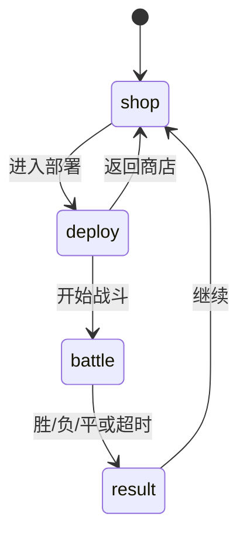

# MC Fight S4 可玩竖切设计 v1.0

日期：2026-09-15。作者：GD / 策划。状态：S4 施工基线，待 owner 人审。

本文件定义第一版真正可玩的 MC Fight。程序完成后，玩家必须能连续经历“商店购买 → 部署 → PvAI 自动战斗 → 结算 → 返回商店再买一轮”。本阶段使用占位美术，完整动作、美术替换和视觉精修留在 S5—S7。

## 1. 本轮完成定义

玩家不看调试工具即可：

1. 启动后直接进入商店。
2. 查看六种单位的详情，购买单位并看到金币变化。
3. 进入部署，将已购单位拖到己方区域，调整位置或撤回待命栏。
4. 开始战斗，双方单位按统一索敌、决策和技能系统自动行动。
5. 战斗产生胜、负或平局，显示结果与奖励。
6. 点击继续后清理本局军队，保留金币并返回商店，再开始下一轮。

S4 只要求一张战场、一个基础敌军难度和六个玩家单位。不在本阶段扩充84单位、随机商店、关卡地图、存档、完整教程或正式美术。

## 2. 阶段状态机

阶段迁移规则：

- `shop`：可查看、购买和出售；至少拥有1个单位才可进入部署。
- `deploy`：可放置、移动、撤回待命栏；至少部署1个单位才可开始战斗。
- `battle`：禁止购买、出售和拖动；所有战斗行为由AI执行。
- `result`：战斗世界停止推进，只允许查看摘要和继续。
- `result → shop`：销毁双方本局单位、攻击区域、召唤物、状态、技能实例和目标关系；金币、轮次及统计保留。

所有操作都必须按当前阶段校验。非法阶段信号不改变状态和资源。

## 3. S4经济与编队规则

### 3.1 金币

- 新会话初始金币：30。
- 胜利奖励：10；失败奖励：5；平局奖励：7。
- 未花金币保留到下一轮。
- 每轮结算后所有购买单位清空，玩家重新购买军队。
- S4 无利息、刷新费、商店随机性或价格成长。

### 3.2 商店

- 六个单位始终可购买，无库存限制。
- 同种单位允许重复购买。
- 玩家同时持有上限6个单位；达到上限或金币不足时购买按钮禁用。
- 在 `shop` 或 `deploy` 阶段出售单位，按购买价100%返还；战斗开始后不可出售。
- 点击单位卡只切换详情，不产生购买。
- 进入部署不会扣费；从部署返回商店保留当前购买和位置记录。

这些规则用于验证循环和数据结构，不表示最终商业平衡。

## 4. 首批六个单位

| ID | 名称 | 价格 | S4定位 | 技能结构 |
|---|---|---:|---|---|
| `vindicator` | 卫道士 | 5 | 基础近战 | 单体挥砍 |
| `skeleton` | 骷髅 | 6 | 基础远程 | 实体弹丸 |
| `vex` | 恼鬼 | 8 | 飞行突击 | 俯冲近战与地面窗口 |
| `elephant` | 大象 | 10 | 冲锋前排 | 距离触发冲锋、近战后备 |
| `earthshaker` | 撼地斯拉 | 12 | 双技能重装 | 大范围近战、长CD远程激光 |
| `witch` | 女巫 | 9 | 范围与续航 | 范围药水、自疗 |

每个单位必须使用统一 UnitDefinition → SkillLoadout → SkillTemplate → DecisionProfile → PresentationProfile 结构。S4 战斗参数统一登记在一个 `S4_BALANCE_V1` 数据表，不得分散成组件构造处的魔法数字。时间单位为秒，距离单位为逻辑世界单位；运行时按引擎固定步长换算。

| 单位 | 最大HP | 移速 | 半径 | 技能参数 |
|---|---:|---:|---:|---|
| 卫道士 | 60 | 3.0 | 0.70 | 挥砍：伤害12、CD1.2、启动距离1.3、前摇0.35、命中段0.10、后摇0.45 |
| 骷髅 | 35 | 2.6 | 0.60 | 骨箭：伤害9、CD1.5、施放距离8、前摇0.40、弹速10、弹丸半径0.25、最大行程10、后摇0.35 |
| 恼鬼 | 32 | 4.0 | 0.55 | 俯冲：伤害14、CD2.4、最大启动距离6、下降0.45、接触段0.35、回升0.45、攻击半径0.65 |
| 大象 | 110 | 2.2 | 1.00 | 冲锋：目标距离≥4、伤害22、CD5、冲锋速度7、命中半径1.1；近战：伤害10、CD1.5、距离1.5 |
| 撼地斯拉 | 140 | 1.8 | 1.20 | 震地：伤害20、CD1.8、半径2.2、前摇0.60；激光：伤害18、CD6、距离10、前摇0.80、光束宽0.6 |
| 女巫 | 55 | 2.4 | 0.65 | 药水：伤害12、CD2.5、距离7、爆炸半径1.6；自疗：治疗15、CD6、生命≤70%且3范围内无敌人时可用 |

S4 所有单位基础护甲为0，避免在护甲公式尚未正式裁定前暗中固化算法。除已写明的范围能力外，伤害只结算敌方；本批六单位没有友伤技能。技能模板中的时序、目标快照与清理仍使用 S2 已验证合同。

参数选择必须满足：

- 卫道士能稳定接近并挥砍。
- 骷髅能在射程内生成真实弹丸并结算一次命中。
- 恼鬼完整执行下降开窗、接触和回升关窗。
- 大象仅在地面目标超过冲锋阈值且CD就绪时冲锋，否则使用近战。
- 撼地斯拉能在距离和CD条件下选择激光，否则接近并近战。
- 女巫受伤且周围安全时优先自疗，否则选择合法攻击。

显式技能优先级：女巫合法自疗高于药水；大象合法冲锋高于近战；撼地斯拉合法激光高于震地；其余单位只有一个主动候选。优先项不合法时才检查下一项。

S4 不以胜率平衡为过关条件，但六个单位都必须在真实对局中至少成功释放一次其代表技能。

## 5. 部署规则

### 5.1 战场坐标

- 逻辑战场：宽40、高24，中心为 `(0,0)`。
- 玩家部署区：`x ∈ [-18,-2]`、`y ∈ [-10,10]`。
- 敌方部署区：`x ∈ [2,18]`、`y ∈ [-10,10]`。
- 中央 `x ∈ (-2,2)` 是战前缓冲区，双方均不可部署。
- 单位完整碰撞圆必须位于所属部署区内。

### 5.2 拖放

- 商店购买的实例先进入待命栏。
- 从待命栏拖到合法玩家区域完成部署。
- 已部署单位可再次拖动；合法落点更新位置。
- 拖回待命栏会撤回部署，不出售单位。
- 落点越界或与己方已部署单位碰撞时，回到拖拽前位置；不得自动挤开其他单位。
- 边界接触视为合法；单位碰撞圆相交视为非法，外切合法。
- S4 不做格子吸附、旋转、阵型模板或自动排布。

### 5.3 开战条件

- 玩家至少部署1个单位。
- 当前没有拖拽中的单位。
- 所有已部署单位引用和位置合法。
- 敌方阵容和部署已经生成。

条件不满足时“开始战斗”禁用并显示单句原因。

## 6. 敌军AI与单位AI

### 6.1 敌军配军

S4 使用确定性的基础敌军预设，不读取玩家具体阵容，不临场作弊：

- 第1轮：卫道士×2、骷髅×1、恼鬼×1。
- 第2轮起：卫道士×1、骷髅×1、恼鬼×1、大象×1。
- 敌方位置由固定阵型槽和当前轮次种子决定，必须可重放。
- 本阶段不做预算搜索、克制分析或难度档位。

### 6.2 战斗决策

- 每只单位只通过共享 DecisionProfile 选择技能和目标。
- 技能候选先过滤：阶段合法、CD就绪、目标合法、距离/状态条件成立。
- 多个技能同时合法时使用显式优先级；同优先级按目录顺序稳定决胜。
- 无合法技能时靠近当前合法目标；没有合法目标时停留并在下一拍重新索敌。
- 目标资格、前摇承诺、硬控打断、死亡清理和俯冲窗口按 CR01—CR15 与 S2 时序合同执行。
- 一切随机使用引擎种子，不得使用裸 `Math.random`。

## 7. 胜负、超时和清理

- 一方所有可战斗单位与仍有效召唤单位死亡时，该方失败。
- 同一结算拍双方均无存活单位，结果为平局。
- 单局上限180秒；超时先比较双方“存活单位当前HP总和 ÷ 这些单位最大HP总和”。
- 比值高者胜；比值相同再比较存活单位数；仍相同为平局。
- 战斗结束后不再启动技能、移动、生成攻击区或结算新的伤害。
- 已排入但尚未结算的同拍伤害完成本拍末结算，再统一判定结果。
- 结算摘要至少显示：结果、奖励、耗时、双方剩余单位数、双方造成总伤害。造成伤害只累计实际扣除的HP，不含过量伤害；治疗不抵扣伤害，实际恢复HP另计为治疗量。

继续下一轮时必须清除所有战斗临时实体和组件关系。尸巫标记等“来源死亡后仍有效”只在战斗尚未结束时保留；跨轮次不保留。

## 8. S4界面结构合同

S4 要固定信息层级，视觉皮肤留到S5：

### 商店

- 顶栏：轮次、金币、持有数量。
- 左/中：六张单位卡，显示名称、价格、定位和购买按钮。
- 右侧：当前选择单位详情，包括基础属性、技能说明、目标能力和关键状态规则。
- 底部：已购待命栏、出售入口、“进入部署”主按钮。

### 部署

- 顶栏：金币、已部署数、开战条件提示。
- 中央：玩家区、缓冲区、敌方区清晰可辨；敌方阵容可见。
- 底部：待命栏、“返回商店”“开始战斗”。

### 战斗

- 顶栏：双方存活数、战斗计时、当前轮次。
- 战场：单位、HP、目标/技能反馈至少可观察；占位几何半径必须来自真实 Shape。
- 玩家没有战斗操作按钮；可提供暂停和正常速度观察控件，但不改变确定性结果。

### 结算

- 结果标题、五项摘要、奖励和“继续购买”主按钮。

所有可操作控件必须有稳定 `data-action`，显示名称和验收信号使用同一词表。

## 9. UI动作与验收信号词表

| 玩家动作 | `data-action` / 验收 signal | 参数 |
|---|---|---|
| 查看单位 | `shop.unit.select` | `{unitId}` |
| 购买单位 | `shop.unit.buy` | `{unitId}` |
| 出售实例 | `roster.unit.sell` | `{instanceId}` |
| 进入部署 | `shop.continue` | 无 |
| 放置待命单位 | `deployment.unit.place` | `{instanceId,x,y}` |
| 移动已部署单位 | `deployment.unit.move` | `{instanceId,x,y}` |
| 撤回待命栏 | `deployment.unit.return` | `{instanceId}` |
| 返回商店 | `deployment.back` | 无 |
| 开始战斗 | `deployment.start` | 无 |
| 继续购买 | `result.continue` | 无 |

真浏览器拖拽可由 pointer 手势产生上述动作，但验收 adapter 只做信号到同一命令入口的薄接线，不复制规则。

## 10. 验收可读状态词表

验收 adapter 必须从真实会话/世界只读以下稳定状态：

- StringVar：`phase`=`shop|deploy|battle|result`；`selected-unit`；`outcome`=`none|victory|defeat|draw`。
- Resource：`gold`、`round`、`owned-count`、`deployed-count`、`player-alive`、`enemy-alive`、`battle-seconds`、`player-damage`、`enemy-damage`。
- Flag：`can-enter-deploy`、`can-start-battle`、`battle-settled`。

这些名称是验收协议，不要求游戏内部只能用同名实体；adapter 不得缓存或伪造它们。

验收环境允许通过 scenario `config.enemyPreset` 选择策划固定的对抗阵容：`standard-round1`、`single-vindicator`、`elephant-trio`。该配置只替换创建世界时的敌方预设，不改变伤害、生命、金币或系统规则，不得做成玩家可见的作弊开关。默认值是 `standard-round1`。

## 11. 程序整批施工范围

1. 在 S3 骨架上实现阶段状态机与阶段操作守卫。
2. 实现固定商店、金币、持有上限、购买、出售和跨轮金币结算。
3. 实现待命栏、真实 pointer 拖放、部署区域及碰撞合法性。
4. 装配六个单位及基础敌军预设，接通真实 S2 战斗链。
5. 实现胜负、超时、结算冻结、统计和完整跨轮清理。
6. 按第8节完成结构化界面，使用成熟 UI 组件和既定主题；暂不做 S5 皮肤精修。
7. 实现薄 `acceptance-adapter.ts`，运行本目录 `acceptance/` 中全部剧本。
8. 完成真实浏览器旅程：购买、拖放、开战、结算、继续；至少保存5张自证截图。
9. 编写 `S4-alignment.md`，逐条对照本文件，所有偏差必须解释并由策划裁定。
10. 运行相关回归、类型检查、构建、系统审计、验收 conformance、walkthrough 和 S4 gate，统一提交独立复查。

## 12. 退回条件

- 任一步骤只有按钮或画面变化，真实会话/世界状态没有变化。
- adapter 或 UI 另写一套经济、部署、胜负或战斗规则。
- 使用单位ID分支替代模板、装配或决策配置。
- 通过改变策划验收剧本来迁就实现错误。
- 拖放只响应点击或测试注入，真实 pointer 手势不可用。
- 战斗结束后仍扣血、生成技能，或下一轮存在上轮实体/状态/CD。
- 六个单位任一代表技能从未在真实战斗路径成功执行。
- 使用未登记 capability 或计划外系统性机制。

## 13. S4之后

S4 通过即获得第一个可玩原型，但不是全量复原版。随后必须先执行 [84单位全量内容复原路线](full-restoration-roadmap.md)，完成旧版事实冻结、全量数据装配、行为验证和内容试玩；该里程碑是S5开始前的项目内部硬前置。之后S5按84单位规模完成正式信息布局，S6完成全量动作、战场、特效和声音，S7调整手感、平衡、性能与视觉品质，S8完成全量回归和交付检查。
